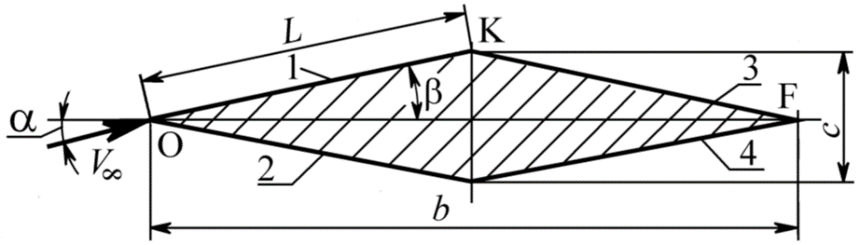

<h1 align="center">Hi there, I'm <a href="https://t.me/artemasdemas" target="_blank">ARTEM DEMCHENKO</a> 

Computer science student from BMSTU [Moscow Bauman Tehnical University], Fullstack developer
<svg xmlns="http://www.w3.org/2000/svg" xmlns:xlink="http://www.w3.org/1999/xlink" width="800px" height="800px" viewBox="0 0 64 64" aria-hidden="true" role="img" class="iconify iconify--emojione" preserveAspectRatio="xMidYMid meet"><path d="M31.9 2c-13 0-24.1 8.4-28.2 20h56.6C56.1 10.4 45 2 31.9 2z" fill="#f9f9f9"/><path d="M31.9 62c13.1 0 24.2-8.4 28.3-20H3.7c4.1 11.7 15.2 20 28.2 20z" fill="#ed4c5c"/><path d="M3.7 22C2.6 25.1 2 28.5 2 32s.6 6.9 1.7 10h56.6c1.1-3.1 1.7-6.5 1.7-10s-.6-6.9-1.7-10H3.7" fill="#428bc1"/></svg>

## Course work on the course "Aerohydromechanics"

# Brief
1. Calculate the parameters of the flow around a pointed profile by a supersonic inviscid flow. The results should be presented in the form of a table.
2. Draw a flow diagram of the profile with the designation of the corresponding structures (numbers of flow areas, compaction jumps, rarefaction waves, flow directions, angles of inclination of structural elements, etc.).
3. Based on the results of inviscid calculation, determine stationary aerodynamic characteristics without taking into account friction in the coupled (cx, cy, mz, sd) and high-speed (cxa, cya) coordinate systems.
4. Calculate the parameters of the boundary layer on the profile at high flow velocities (taking into account compressibility). See the guidelines "Calculation of flow parameters on the wing profile ...", part 2. The results should be presented in the form of a table.
5. Determine the correction for friction for the coefficient of longitudinal force (cxf) and drag force (cxaf).
6. Draw a diagram of the boundary layer on the profile with the designation of the corresponding design points and flow areas.
7. To perform calculations (all items of the task, except 2 and 6), write a program in a high-level language with the implementation of frequently repeated elements of the algorithm in the form of subroutines or subroutines-functions. In particular, the program should have a module for calculating the parameters of the standard atmosphere for a given geometric height (up to 70 km inclusive).
 
# Initial data
<h3 align="center">Geometry of the diamond-shaped profile.<h3>

# Requirements
<h3 align="center">Numerical results of calculations should contain (in a form convenient for control, in particular, in the form of tables):</h3>

1. Initial data.
2. Parameters of the standard atmosphere at a given altitude.
3. Inviscid flow parameters for 6 flow regions in the form of a table containing:
    - Mach number; 
	- static and full flow pressure;
	- static density;
	- static temperature, braking temperature;
	- dynamic viscosity, specific heat capacity at constant pressure and thermal conductivity at the boundary of the inviscid flow and boundary layer;
	- angles (in degrees) of the slope of the compaction jump (if any), the slope of the rarefaction wave, the flow direction (for areas 5 and 6).
4. Recovery temperatures and defining temperatures for each face. If there are both LPS and TPS on the edge, then the temperatures should be given for both flow modes.
5. Corrected critical Reynolds numbers for 1 and 2 faces, corresponding critical coordinates of the transition of LPS to TPS.
6. For each design point on the profile surface:
    - the physical coordinate from the beginning of the face (the physical coordinates on each face start from zero);
    - a fictitious (calculated) coordinate from the beginning of the expected increase in TPS;
    - designation of the type of boundary layer (laminar or turbulent);
    - estimated Reynolds number;
    - characteristics of the compressible boundary layer: thickness, friction stress, local coefficient of friction, displacement thickness and momentum loss thickness.
7. An average coefficient of friction should be obtained for each face.
8. Coefficient of longitudinal force due to friction (obtained by recalculation from the average friction coefficients along the edges, taking into account the correct characteristic dimensions of the profile as a whole).

> UI and calculation programm by JS